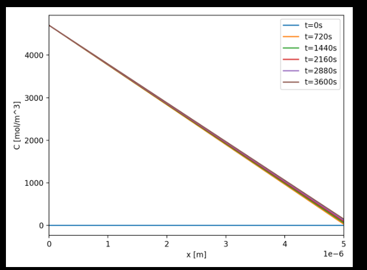
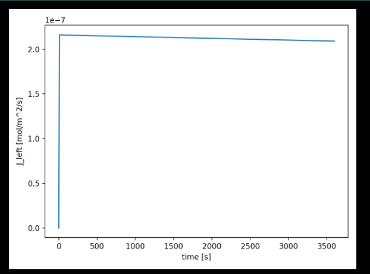

# Results — Sprint 1

This folder contains the main outputs from **Sprint 1**, where hydrogen diffusion through a stainless steel wall was modeled using **Fick’s law** with **Sieverts’ law** boundary conditions.  

---

### Concentration profile (`profile.png`)  
  

- Shows how hydrogen concentration evolves across the slab.  
- At t = 0 s the profile is flat (zero concentration).  
- Over time, it develops into the expected **linear steady-state gradient**.  

---

### Flux vs time (`flux.png`)  
  

- Shows the transport rate at the high-pressure boundary.  
- Flux starts near zero, rises as hydrogen enters, and levels off toward a steady plateau.  

---

## Key outcomes  
- Solver produced **stable results** and matched the expected steady-state solution.  
- The concentration profile evolved as theory predicts.  
- Flux increased with time and approached a plateau.  
- Provides a reliable baseline for **Sprint 2**, where temperature and pressure effects will be added.  
