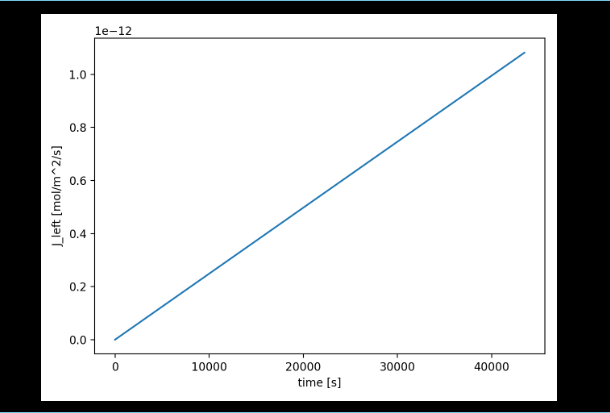

---

### Flux vs time (`Flux.png`)  
  

- Shows the transport rate at the high-pressure boundary.  
- Flux starts near zero, rises as hydrogen enters, and levels off toward a steady plateau.  

---

### Console log output (`Terminal Result.png`)  
  

- Records the parameters and numerical checks:  
  - Grid size, timestep, stability factor (`r ≤ 0.5`)  
  - Diffusion coefficient `D`  
  - Boundary concentrations (from Sieverts’ law)  
  - L² error vs the analytical steady-state profile  
- Confirms the solver is numerically stable and convergent.  

---

### Raw numerical data (`raw_data.csv`)  
- Contains time-resolved flux values and concentrations.  
- Enables reproducibility of the plots and further analysis.  

---

## Key outcomes  
- Solver produced **stable results** and matched the expected steady-state solution.  
- The concentration profile evolved as theory predicts.  
- Flux increased with time and approached a plateau.  
- Provides a reliable baseline for **Sprint 2**, where temperature and pressure effects will be added.  
